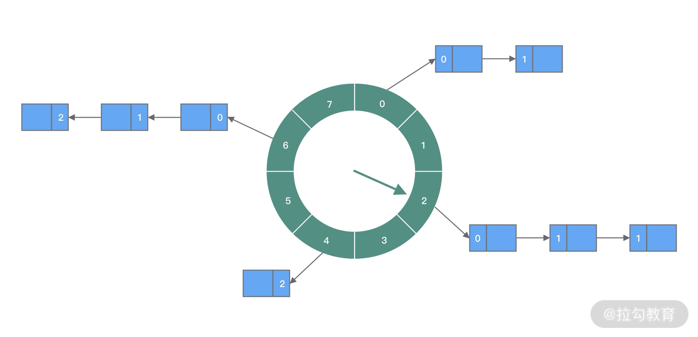

# tiny-time-wheel
`tiny-time-wheel` 是一个用 Java 实现的单层时间轮算法。

## 1. 快速使用
使用实例
```java
    public static void main(String[] args) throws InterruptedException {
        // 创建一个时间间隔为 100ms，10 个时间槽的时间轮
        TinyTimeWheel tinyTimeWheel = new TinyTimeWheel(100, TimeUnit.MILLISECONDS,10);
        
        long startTime = System.currentTimeMillis();
        
        // 加入 300ms 之后执行的任务
        tinyTimeWheel.scheduledTask(new TinyTimeTask() {
            @Override
            public void run() {
                long cost = System.currentTimeMillis() - startTime;
                System.out.println("after 300ms task, cost: "+ cost + "ms");
            }
        }, 300, TimeUnit.MILLISECONDS);

        // 加入 100ms 之后执行的任务
        tinyTimeWheel.scheduledTask(new TinyTimeTask() {
            @Override
            public void run() {
                long cost = System.currentTimeMillis() - startTime;
                System.out.println("after 100ms task, cost: "+ cost + "ms");
            }
        }, 100, TimeUnit.MILLISECONDS);
        Thread.sleep(1000);
        // 时间轮停止
        tinyTimeWheel.stop();
    }
```
数据结果
```
after 100ms task, cost: 105ms
after 300ms task, cost: 302ms
```

## 2. 实现思路
### 单层时间轮整体结构

`图源网络，如有侵权，请联系删除`

如图所示，时间轮将整段时间划分成多个时间槽（`bucket`），每个槽与槽之间有一定时间间隔（`duration`）。指针每隔 `duration` 就扫描 `bucket` 上的任务列表（`taskList`），执行`等待执行状态`的任务。

有以下四个主要元素组成：
* 时间轮(`wheel`)：由多个时间槽组成，逻辑上头尾相连。
* 时间槽（`bucket`）：表示一整段时间的其中一部分，例如：将 1000 ms 划分成 100 个时间槽，每一个时间槽则表示 10ms。
* 任务列表(`taskList`)：存储待执行的定时任务，本质上是一个链表。
* 指针(`tick`): 按照设定的间隔时间扫描 `bucket`。

### 3. 代码实现
#### 3.1 线程模型
`tiny-time-wheel` 采用单线程模型；时间槽扫描和任务执行均为同一工作线程；当然，使用一个工作线程的很多弊端，例如任务的时间执行精度下降、线程可能会被某个任务异常而导致直接卡死；关于这一点会在
后续考虑引入线程池来进行任务执行，引入线程池，则需要考虑更多的并发场景，例如任务的状态维护，不过在时间轮实现中谈不上复杂，后续有时间会改造加上~

#### 3.2 核心实现思路
**A. 时间槽数量参考 hashMap 实现**

因为每一个定时任务都需要进行哈希找到对应的时间槽，即需要进行取模运算，例如： 将 1000 ms 划分成 100个 10ms 时间槽组成，那对于定时 100ms 之后执行的任务来说，`100 % 1000 = 10`，即将任务存放在第 10 个时间槽中。
位运算执行速度要比执行 `%` 快。在生成时间轮槽数的时候，我们控制其生成的值为 2 的幂数。以 `a & n -1` 取代 `a % n`。相关代码如下:
```java
    private int normalizeWheelBucketNum(int bucketNum) {
        // 参考 hashmap的算法
        int n = bucketNum - 1;
        n |= n >>> 1;
        n |= n >>> 2;
        n |= n >>> 4;
        n |= n >>> 8;
        n |= n >>> 16;
        // 这里1073741824 = 2^30,防止溢出
        return (n < 0) ? 1 : (n >= 1073741824) ? 1073741824 : n + 1;
    }

```
取模计算
```java
private int getBucketIndex(int tick) {
    return tick & mask;
}
```

**B. 新增定时任务时，引入队列解耦、简化处理并发问题**

当有新的定时任务需要加入到时间轮的时候，并没有采用直接加入的方式；而是先加入到 `Queue<TinyTimeTaskHolder> timeoutQueue` 队列中，由指针扫描的时候将队列中的任务加入到时间轮。

好处是：
1. 解耦削峰：将任务提交和执行解耦开，分别由不同的线程来处理，逻辑解耦，同时也可以避免短时间内大量任务提交导致资源都耗在将任务加入到时间轮中。
2. 并发场景处理简单：定时任务的提交都是统一由队列处理，只需要保证队列是线程安全即可实现线程安全。

缺点是：
1. 定时任务的准确性下降：因为不是立即加入到时间轮中，相比较之下时延较大
2. 需要额外的内存开销：因为维护了一个列表来存储**待加入时间轮的任务**

**C. 如何确认新增的定时任务应该加入到哪个时间槽中**

参考 `netty` 单层时间轮实现：
1. 当时间轮开启的时候，记录开启时间 `startTime`, 记录时间轮距离`startTime`已经经过多少个设定的时间间隔，用 `tick` 表示
2. 当有新的定时任务需要加入到时间轮时，计算定时任务的实际执行时间： `executeTime = timeUnit.toMillis(delay) + System.currentTimeMillis()`
3. 然后以`startTime`作为基准，计算出两者之间还相差多久 `offset = executeTime - startTime`
4. 根据设定的时间轮间隔 `duration`，计算出时间轮还需要指针走多少步才会执行 `taskTickCount = offset / duration` 
5. 判断 `taskTickCount` 与 `tick` 的大小关系、

具体的代码实现如下：
```java
// 计算任务执行时间需要具体多少次时针移动才能到达
long offset = taskHolder.getExecuteTime() - startTime;
int taskTickCount = (int) (offset / duration);
if (taskTickCount < tick) {
    // 说明任务在队列呆着已经超过了真正的执行时间，直接加入到当前 bucket，立即执行
    wheel[getBucketIndex(tick)].getTaskList().add(taskHolder);
} else {
    // 计算轮数
    int rounds = (taskTickCount - tick) / wheel.length;
    taskHolder.setRounds(rounds);
    // 取模计算实际的时间槽位置
    wheel[getBucketIndex(taskTickCount)].getTaskList().add(taskHolder);
}

// 计算具体的时间槽位置
private int getBucketIndex(int tick) {
    return tick & mask;
}
```
**D.指针如何计算等待下一个时间间隔？**

最简单的做法就是固定让线程 `Thread.sleep(duration)`， 因为我在实现中，代表指针的线程不仅仅是扫描时间槽而已，还会执行其中的任务，所以当执行完成任务之后，很可能已经超过了设定的时间间隔，
这样就会让后面的任务都延后。所以我在实现的时候，每次都先计算一下，下一个时间槽的实际执行时间，然后跟当前时间比对；实现如下
```java
// 计算下一次执行的绝对时间
long nextExecuteTime = (this.tick + 1) * duration + startTime;
long sleepTime = nextExecuteTime - System.currentTimeMillis();
if (sleepTime > 0) {
    try {
        Thread.sleep(sleepTime);
    } catch (InterruptedException e) {
        // 出现了中断异常
    }
} else {
    // 说明当前已经超过了设定的时间间隔，不再进行 sleep，直接执行
}
```
#### 3.3 源码核心组件简介
**TinyTimeWheelBucket**
```java
public class TinyTimeWheelBucket {
    /**
     * bucket 中的任务列表
     */
    private LinkedList<TinyTimeTaskHolder> taskList;
}
```
时间槽，包含了任务列表。

**TinyTimeTask**
```java
public abstract class TinyTimeTask implements Runnable {
}
```
是一个抽象类，实现 `Runnable` 接口


**TinyTimeTaskHolder**
```java
public class TinyTimeTaskHolder {

    /**
     * 定时任务
     */
    private TinyTimeTask timeTask;

    /**
     * 任务延迟时间
     */
    private Long executeTime;

    /**
     * 周期数
     */
    private Integer rounds;

    /**
     * 任务状态 
     */
    private Integer status;
}
```
封装了 `TimeTask`，其中，还附带任务的其他信息

**TinyTimeWheel**

时间轮本体，实现了 `TimeWheel` 接口
```java
public interface TimeWheel {

    /**
     * 定时任务
     *
     * @param timeTask 任务
     * @param delay    延迟时间
     * @param timeUnit 时间单位
     */
    void scheduledTask(TinyTimeTask timeTask, long delay, TimeUnit timeUnit);

    /**
     * 停止
     */
    void stop();
}
```
**TickWorker**

即时间轮指针，实现了 `Runnable` 接口；指针每隔设定的间隔时间开始“循环”扫描时间轮。
```java
private class TickWorker implements Runnable {

    /**
     * 具体时间轮开始时间有 tick 个 duration，即距离开始时间的的绝对长度
     */
    private int tick;
}
```
